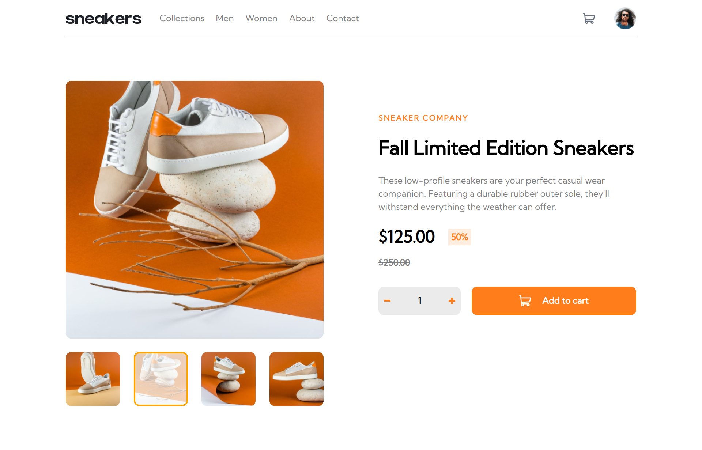

# Frontend Mentor - E-commerce product page solution

This is a solution to the [E-commerce product page challenge on Frontend Mentor](https://www.frontendmentor.io/challenges/ecommerce-product-page-UPsZ9MJp6).

## Table of contents

- [Overview](#overview)
  - [The challenge](#the-challenge)
  - [Screenshot](#screenshot)
  - [Links](#links)
- [My process](#my-process)
  - [Built with](#built-with)
  - [What I learned](#what-i-learned)
  - [Continued development](#continued-development)
  - [Useful resources](#useful-resources)

## Overview

### The challenge

Users should be able to:

- View the optimal layout for the site depending on their device's screen size
- See hover states for all interactive elements on the page
- Open a lightbox gallery by clicking on the large product image
- Switch the large product image by clicking on the small thumbnail images
- Add items to the cart
- View the cart and remove items from it

### Screenshot

### Links

- [Solution URL](https://www.frontendmentor.io/solutions/ecommerce-product-page-using-sass-react-ryQAdiMr9)
- [Live Site URL](https://rodri-97.github.io/ecommerce-product-page/)

## My process

### Built with

- Mobile-first workflow
- Semantic HTML5 markup
- [Sass](https://sass-lang.com/)
- Flexbox
- CSS Grid
- [React](https://reactjs.org/) - JS library

### What I learned

- I had been using flex more often than grid in my last projects, but for this one I ended up using grid more often because it’s more useful for making elements the same size.
- I also learned how to pass a whole component (ImageSlider) as prop to another component (Lightbox).

### Continued development

I'm still not sure what's the best way to style React applications. At the start of this project I thought I would be using CSS modules but then I decided that plain Sass would be a cleaner and less tedious solution. I might try styled components in the future.

### Useful resources

- [Simple Image Lightbox Tutorial](https://www.youtube.com/watch?v=uKVVSwXdLr0&ab_channel=WebDevSimplified) - Helped me with the lightbox.
